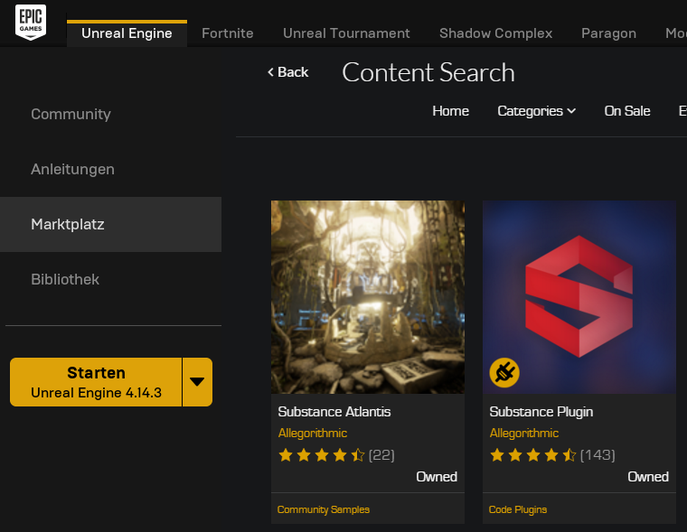
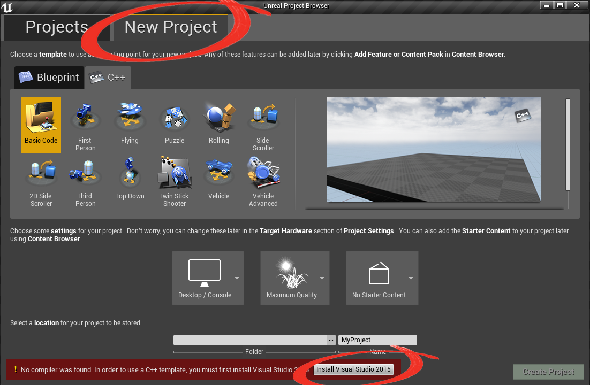
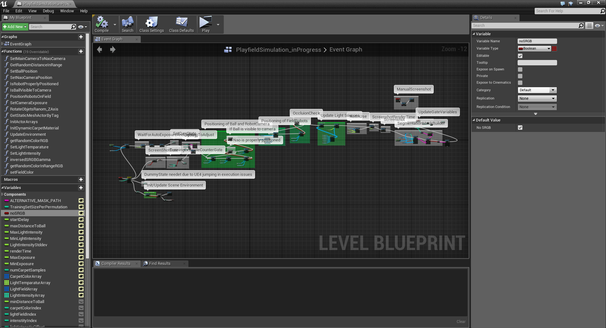

# <span style="color:#0000FF">__UERoboCup__ </span>

## <span style="color:#5555FF"> __INSTALL: Preparing Unreal Engine 4__ (Windows)</span>
#### __Engine Basis Installation:__
Go to the [https://www.unrealengine.com/](https://www.unrealengine.com/) website and create your EpicGames account, download the "EpicGamesLauncher" (UELauncher) and install it. <br/>
After the installation is complete, log into the UELauncher and use it to download Unreal Engine 4 Version __4.14.3__. 
*Newer versions might also work, but have not been tested.*

#### __Substance Plugin:__
Making use of the PBR(physics based rendering) capabilies of UE4 we incorporated Materials provided by __Allegorithmic__ ([https://share.allegorithmic.com/](https://share.allegorithmic.com/)). To be able to use these Materials you will need to add the __Substance Plugin__ to UnrealEngine, which is available __for free__ in the UELaunchers __Marketplace__. <br/>
After downloading the plugin from the marketplace do not forget to add it to the Engines installation you are using: 




#### __C++ Support:__
If you want to add or edit C++ modules to the Training Set Generator you will additionally need to install __Visual Studio__ on your machine. Again the UELauncher provides a built in function for directly coupling the Visual Studio Compiler to your Engine's installations: <br/>
To do so, use the UELauncher to start the engine and go to the __New Project__ tab. Select __C++ Project__.  <br/>
At the bottom of the UELauncher there should appear a message pointing towards a missing compiler and additionally a installation link to the respective VisualStudio version needet.

 

After completing all the above steps the installation of UnrealEngine4 is complete and you can go ahead an load the __TrainingSetGenerator__.uproject. *The first time UnrealEngine4 may need some time setting up and recompiling components for your system*


<br/>

## <span style="color:#5555FF"> __GETTING STARTED: A Quick Guide__</span>
*This section will give an overview of how to use use/manuipulate the TrainingSetGenerator project, but should by not be seen as a tutorial on how to operate UnrealEngine4 (/UEEditor). For in depth information please see the [UnrealEngine Documentation](https://docs.unrealengine.com/latest/INT/) or one of many third party tutorials (e.g. Youtube).* 

#### __Generating The First Synthetic Set:__ 
Open the __TrainingSetGenerator.uproject__ file. <br/>
You will see the __UEEditor__ similar to this: 


Move to the __Play__ button and select the __New Editor Window__ option. <br/>
*In the current version this play option is needed to ensure correct aspect ratios on the rendered images*. 

Now you can hit the __Play__ button to generate a (small) "test" set of synthetic data. 


#### __Locations of Synthetic Data:__
__Location of rendered Images:__ <br/> ``` \TrainingSetGenerator\Saved\Screenshots\Windows ```

__Location of semantically annotated ground truth:__ <br/> ``` \TrainingSetGenerator\Saved\ScreenshotMasks ```


#### __Adjust Training Set Generation:__
Currently all variables needed to adjust the generation pipeline behavior are found in the __LevelBlueprint__. <br/>
You can access the LevelBlueprint by:




The BlueprintEditor effectively splits into three parts: The Blueprint graph (middle), the function and global variable overview (left), and a details panel (right). 

To change the value of a variable simply select it and adjust its __Default Value__ in the details panel.


## <span style="color:#5555FF"> __VARIABLES: Overview__</span>
*The __public__ variables (marked by the "open eye" symbol) control the main features of the generation pipeline, such as number of synthetic data to be created per execution or standard deviation of the intenstiy of the light sources. <br/> 
The __private__ variables (marked by the "closed eye" symbol) contain bounds, counters, and object-array placeholders and should thus not be altered.*

#### __Public__:

__``` sceneParameterUpdates ```__: <br/>
Number of __LightTemparature__,  __LightIntensity__, and __FieldColor__ samples.

__``` geometricParameterUpdates ```__:  <br/> 
Number of playing situations generated per scene parameter set.

__``` startDelay ```__:  <br/>
Time delay befor the actual generation process starts. This is needed on some systems to load the scene.

__``` renderTime ```__:  <br/> Controls the time delay befor saving the current image render. The delay represents the actual render time the engine needs per image. Due to the full rearangement of the scene in each step in combination with the engine's real-time rendering component, low renderTimes (e.g. 0.0) may result in blurry or edgy images.

__``` maxDistanceToBall ```__:  <br/>
The maximum distance in cm the ball is placed away from the camera robot. 

__``` lightIntensityStddev ```__: <br/>
Standard deviation of the normal distribution controling the offsets between individual light sources to take account to wear level etc. .

__``` carpetColorArray ```__: <br/>
Givs minimum and maximim values for carpet color sampling.

__``` lightTemparatureArray ```__: <br/>
Gives minimum and maximum value for light source temparature sampling.

__``` lightTemparatureArray ```__: <br/>
Gives minimum and maximum value for light source intensity sampling.

__``` cameraExposureArray ```__: <br/>
*NOT IN USE!* <br/>
Gives minimum and maximum value for camera exposure sampling.

#### __Private__:
*Coming soon...*